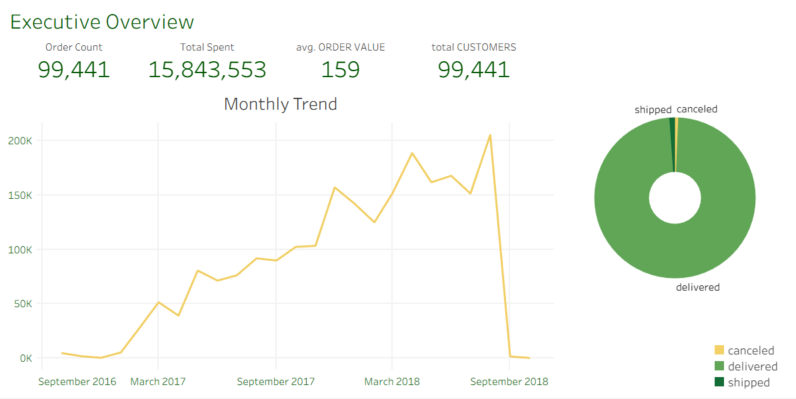
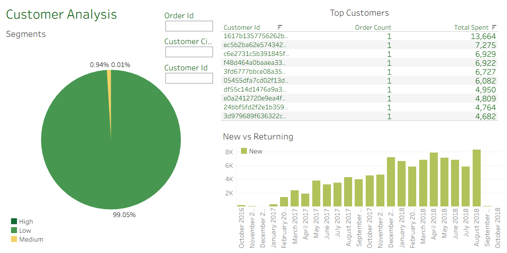

# E-Commerce Analysis

## Project Overview

This project is an exploratory data analysis (EDA) of e-commerce data, with the aim of uncovering insights related to sales, customer behaviour, product categories, seasonality, and other KPIs. The analysis is done using Jupyter notebooks and visualised also via dashboards in Tableau.

## Table of Contents

- [Data](#data)  
- [Analysis](#analysis)  
- [Tableau Dashboards](#tableau-dashboards)  
- [Results & Key Findings](#results--key-findings) 

---

## Data

The data comes from the Kaggle dataset *“E-commerce dataset by Olist as an SQLite database”*. :contentReference[oaicite:0]{index=0}

- The data has been assembled into an SQLite database. :contentReference[oaicite:2]{index=2}  
- The time period covered is roughly between 2016-2018. :contentReference[oaicite:3]{index=3}  

---

## Analysis

The notebooks folder contains Jupyter notebooks that perform:

1. Data cleaning & preprocessing  
2. Exploratory data analysis (key metrics: total sales, orders, customers, product performance)  
3. Trends over time (seasonality, monthly/weekly/daily patterns)  
4. Category / product-level analysis  
5. Customer behaviour / segmentation  

---

## Tableau Dashboards

Below are some screenshots of the Tableau dashboards created as part of this project:

> *These visualizations are located in the `dashboards/tableau/screenshots` directory.*

### Dashboard 1

*Example of overall sales trends over time, showing monthly revenue, orders count, and average order value.*

### Dashboard 2

*Visualization of different customer segments and their contributions to revenue.*

---

## Results & Key Findings

Here are some of the major insights discovered:

- **Sales Growth:** Continuous upward trend, peaking in 2018.  
- **Customer Base:** ~100k unique customers, suggesting strong market penetration.  
- **Order Fulfillment:** 99%+ of orders are delivered successfully → strong logistics performance.  
- **Cancellations:** Minimal cancellations, indicating customer satisfaction and reliable processes.  
- **Average Order Value:** ~159 (currency unit not specified), stable across the dataset.  
---

